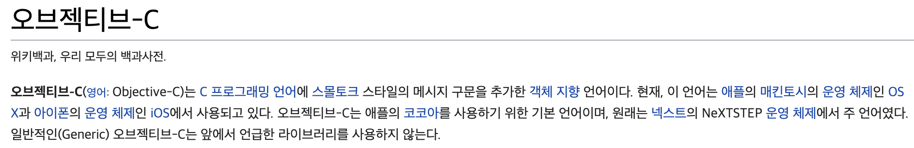
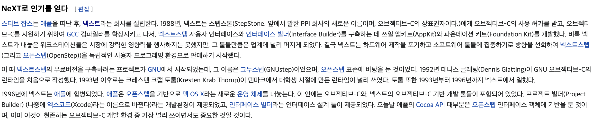
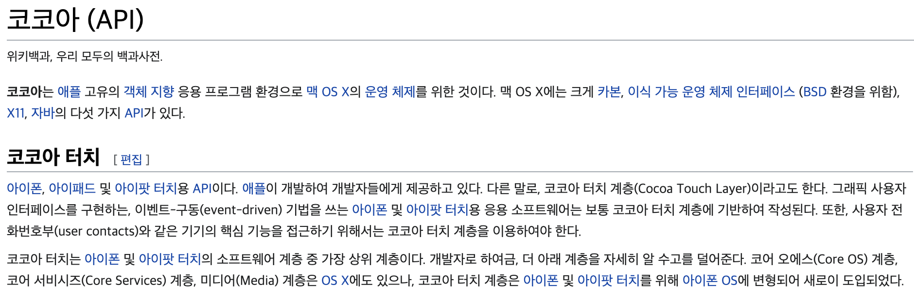

# 1주차 - Swift iOS Basic

20.12.02(수)

### 1교시

# Zeplin

디자인 가이드 툴

- 여백, autoLayout
- image asset
- color set

# Apple

## Objected-C

https://ko.wikipedia.org/wiki/오브젝티브-C

https://ko.wikipedia.org/wiki/NeXT

- NS 접두사: NeXTSTEP의 약자, Objected-C의 nameSpace

  ex) NSObject, NSLog, NSMutableArray, NSString ...

## Cocoa

- Cocoa: Foundation + AppKit

https://ko.wikipedia.org/wiki/코코아_(API)

- CocoaTouch: Foundation + UIKit

## LLVM

- JVM (Java Vertual Machine) - 한계: 속도가 느리다
- LLVM

- Kotlin / Native

# Swift

1. Fast(신속성) - 알고리즘 푸는 속도 독보적
2. Expressive(표현성) - 5주차
3. Safe(안정성) - 변수와 상수, Optional

## 변수와 상수

의도와 다르게 실행될 가능성을 막아준다.

side effect: 클래스 전역에 선언된 변수가 함수에서 변경되는 것

- 변수 선언 var
- 상수 선언 let

## 다양한 타입

String, Int, Double, Bool, Array, Dictionary

## Control Flow

- for in loop
  - for name in names { }
  - for index in 1...5 { }
- if
- guard - pre-Condition Check

### 2교시

## Optional

런타임에 nil에 접근 시 충돌이 일어나기 때문에(NPE: Null Point Exeption) **컴파일 타임**에 nil에 접근할 가능성이 있을 경우 방어 코드를 작성하도록 만든다.

- 옵셔널 체이닝

  - let title = viewController**?**.title

- 강제 해제

  - let title = viewController**!**.title

  런타임에 크래시 가능성이 있음

- ??

  - let title = viewController**?**.title **?? "Hello"**

# Struct & Class

OOP를 위한 필요 요소

interace, implementation 파일을 분리하지 않아도 된다.

- 값을 저장하기 위한 프로퍼티 정의
- 기능을 제공하기 위한 메소드 정의

## Class만 가능한 것

1. 상속 Inheritance
2. 타입 캐스팅 Type casting: 런타임에 타입 확인
3. 소멸자 Deinitalizer: 할당된 자원을 해제 시킴 (free up)
4. 참조 카운트 Reference counting: 클래스 인스턴스에 하나 이상의 참조가 가능

### 용도는?

- 클래스를 사용해야 하는 경우: 상속, 참조(reference)

### Stack & Heap

- Stack: LIFO, read & write가 빠르다, 함수 실행이 끝나면 사라짐
- Heap: 임의의 위치에 객체가 생성되는 방식 (dynamic allocation), 전역 변수이므로 어디서나 참조할 수 있어 메모리 절약 가능

Polymorphism Through V-Table Dispatch

- final 을 통해 막아줄 수 있음

## Function

## Closures

어떤 상수나 변수의 참조를 캡쳐해 저장할 수 있다. Swift는 이 캡쳐와 관련한 모든 메모리를 알아서 처리한다.

- 전역 함수: 이름이 있고 어떤 값도 캡쳐하지 않는 클로저

- 중첩 함수: 이름이 있고 관련한 함수로 부터 값을 캡쳐할 수 있는 클로저

- 클로저 표현: 경량화된 문법

  abc() { $0 + $1 }

  func loadPicture(picture: ~~,completion: ~~, onFailure: ~~)

  loadPicture(picture: ~~) {

  } onFailure: {

  }

### 3교시

# Xcode 톺아보기

# Git

버전(형상)관리 시스템, diff를 떠서 수정된 사항만 저장

- git kraken
- git fork

## 📌 과제

개인 계정에 repository 생성 - iOSCare+

Swift 문서 읽어오기

https://docs.swift.org/swift-book/LanguageGuide/TheBasics.html

영어가 버겁다 https://jusung.gitbook.io/the-swift-language-guide/