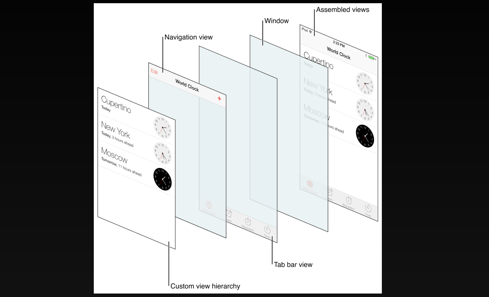

# 2주차 Storyboard, Autolayout, TabBar, MVC

## Interface Builder

Xcode 내에서 코드를 작성하지 않고 전체 사용자 인터페이스를 간단하게 디자인할 수 있게 해준다.

`nib`: NeXT Interface Builder - 관리하기 불편하기 때문에 `xib` 형태로 다시 만들었다.

`xib`: Xml Interface Builder, 그러나 빌드하게 되면 결국 `nib` 로 만들어진다.

완전한 iOS 앱은 사용자가 탐색하는 여러 뷰로 구성된다. 앞뒤 내용을 통해 앱의 흐름을 알 수 있도록 하는 것이 Storyboard이다. (iOS SDK 5부터 지원)

### Storyboard

- Outline view: 스토리보드에서 객체들이 어떤 계층구조를 가지고 있는지 보여줌

- inspector: 속성들을 변경할 수 있음

- Change device configurations

- Open the library: Drag an object from the library (코드에서는 코드 스니펫 등을 이용할 수 있음),

  단축키 `cmd` + `shift` + `L`

  `option` 키를 함께 누르면 새 창으로 열려서 여러개의 아이템을 추가할 때 유용


- ViewController와 연결: Outlet, Action
- Storyboard Segue
- initial View Controller는 Storyboard 당 하나만 지정 가능
- Adjust Editor Options → Assistant
- `option` 키와 함께 계층 구조에서 열고 싶은 파일을 선택

Storyboard에서 각 객체에서 우클릭 또는 인스펙터에 맨 마지막 탭


- Adjust Editor Options → Preview

  기기들을 추가해서 다양한 기기에서 어떻게 보이는지 한번에 확인할 수 있다.


## Autolayout

iOS와 macOS에는 모두 자동 레이아웃이라는 강력한 레이아웃 시스템이 포함되어 있다.

다양한 기기에서 원하는 위치에 대상체를 보여줄 수 있도록 하는 방법 중 하나이다.

앱이 다른 화면 크기, 회전 등 새로운 로케일에서 실행 시 작동하는 방식을 정의할 수 있다.


→ 한 뷰의 크기나 위치가 변경될 때 해당 뷰와 인접 뷰의 크기와 위치가 적절하게 조정되도록 제약 조건이라는 관계를 정의한다.

→ 장치 구성이나 언어가 변경 될 때 마다 자동으로 크기가 조정되고 위치가 변경된다.

ex) 슈퍼 뷰에서 가로로 가운데에 맞추면 기기 회전 시 기기의 가로 및 세로 방향으로 가로 중앙에 유지된다.

### 외부 변화

- 사용자가 창 크기를 저장한다. (OS X)
- 사용자가 iPad로 분할보기를 시작하거나 종료한다. (iOS)
- 기기가 회전한다. (iOS)
- 활성 통화 및 오디오 녹음 막대가 표시되거나 사라진다. (iOS)
- 다양한 화면 크기를 지원하려고 한다.

### 내부 변화

- 앱에서 표시하는 콘텐츠가 변경됩니다.
- 국제화(Localizing)를 지원한다.
- 동적 테스트 크기(iOS)를 지원한다.

UIKit 모든 사용자 인터페이스는 UIView 위에 구축되어 있다. ex) UIButton, UILabel, UITextField...

`hierarchy`: 앱의 View는 계층 구조로 정렬된다.

각 View는 부모 내에 표함되며 각 View에는 하나 이상의 자식 View가 포함될 수 있다.

```
💡 모든 뷰는 슈퍼뷰를 가지며, 모든 화면은 뷰를 가진다.
```


1. leading과 view의 width
2. leading과 trailing
3. leading과 centerY: 가운데 정렬을 하게 되면 내부적으로 자동으로 대칭 형태로 만들어진다. 따라서 view의 width가 정해진다.


→ `위치`, `크기` 가 정해졌는지가 가장 중요

- BlueView와 RedView 사이의 제약 조건이 8이다.


→ RedView의 왼쪽은 1.0 * BlueView의 오른쪽 + 8.0

- Attribute의 속성: 위치(왼쪽, 오른쪽, 상단, 하단), 크기(너비와 높이)


- Baseline: 텍스트의 경우 실제 글자의 사이즈와 객체의 사이즈가 다르다. 이는 글자가 실질적으로 시작되는 위치를 의미한다.

- Left, Right: 왼쪽, 오른쪽

  leading, trailing: 시작하는 쪽, 끝나는 쪽

  ex. 아랍같은 국가에서는 오른쪽에서 시작해서 왼쪽으로 끝나게 된다.


### Multiplier

두 항목 속성 사이의 관계에 적용할 수 있는 비율

ex)  label B를 label A의 두 배 높이로 설정

### Constant

상수는 제약 조건에 추가하는 고정 값

ex) label A의 leading은 슈퍼뷰의 leading에서 16포인트 떨어져 있다

### Intrinsic content size

내부 콘텐츠 크기는 콘테츠에 따라 뷰가 자연스럽게 차지하는 크기

풍선처럼 그 안에 공기를 넣을수록 공기가 커지고 풍선도 커진다.

일부 뷰는 내부 콘텐츠 크기를 가지고 있습니다. ex) UILabel, UISwitch, 이미지가 들어있는 UIImageView 등

### Priorities

뷰 계층 구조에 적용된 모든 제약 조건을 충족할 수 없는 경우, 우선순위를 사용하여 해결

### Constraint priority

자동 레이아웃이 충족하기 위해 어떤 제약조건이 더 중요한지로, 1~1000 사이의 값을 사용

### Content hugging priorities

컨텐츠 허깅 우선 순위를 지정하면 기본 크기보다 크게 확장되는 뷰를 결정하는 데 도움이 된다.

이 값이 낮은 뷰가 넓어진다는 의미이다.

ex) UILabel 두 개가 붙어있을 경우

### Compression resistance priorities

압축 저항 우선 순위는 축소되는 뷰를 고유 크기보다 크게 확장되는 뷰를 결정하는 데 도움이 된다.

이 값이 낮은 뷰가 축소된다는 의미이다.

- 정렬 제약 조건: 두 개 이상의 뷰를 선택한 후 정렬에 대한 설정
- 슈퍼뷰에 대한 centerX, centerY는 항상 선택 가능


Remove at build time: Code로서 사이즈 지정 시 error 방지를 위해 임시 값 지정하는 용도로 사용할 수 있음


Update frames


Code로서 사이즈를 지정해주는 경우 Storyboard에서 임시 값 지정


Safe area (iOS 10부터 지원)


## MVC (Model View Controller)

Spring에서도 MVC 아키텍처를 사용한다.

iOS에서 사용하는 MVC는 정통 MVC라기 보다 애플에서 개조한 형태의 MVC이다.


→ 노란색 두줄은 넘어갈 수 없음

→ 점선에서 실선 방향으로만 이동할 수 있음

→ 유지보수를 쉽게 하고, 재사용성을 높이기 위해 위 사진처럼 설계한다.

- Controller만 Model와 View에 접근할 수 있다.

- View와 Model은 Controller에 접근하면 안된다.

  ex) tableViewCell에서 ViewController에 접근하여 해당 셀에서 특정 뷰 컨트롤러에서 동작하는 작업을 정의하게 된다. 이렇게 되면 테이블뷰셀을 재사용하는 것이 불가하게 된다.

- delegate 채택: Controller를 직접 아는 것이 아니라 의존 관계를 낮춰준다.


- model: UILabel, UIButton 등에 표시되는, 변경이 일어날 수 있는 값들은 모두 model에서 받아오는 것이 맞다.

  ex) button.setTitle, button.isSelected 등의 값도 모두!!!

  해당 값들의 재사용성을 높이기 위해 model을 구성하는 방식이다. (반복된 코드를 줄인다.)

  ex) url 통신 시 count와 offset 값의 변동이 필요할 때 재사용하기 위해 model로 구축


## UITabBarViewController

- TabBarView와 TabBarController에 직접 접근하면 안된다.
- 각 탭들은 TabBarController의 `viewControllers` 속성에 루트 viewController들을 생성해서 넣는 방식
- `selectedViewController` 속성을 이용해서 탭을 선택할 수 있다.
- `selectedIndex` 배열을 이용해서 선택된 뷰 컨트롤러를 얻을 수 있다.
- 뷰 컨트롤러가 선택되면 자동적으로 사이즈를 맞춰준다.
- UITabBarItem을 이용해서 아이템을 생성한 후 `tabBarItem` 속성에 넣으면 됩니다.
- `UITabBarControllerDelegate` 프로토콜을 이용해서 상호작용들에 대한 알림을 받을 수 있다.



- 탭 표시줄에는 사용자 정의 항목을 표시할 수 있는 공간이 제한되어 있다.
- 6개 이상의 뷰 컨트롤러를 추가하는 경우 처음 4개의 항목과 탭 모음의 More 항목만 표시된다.
- More 항목을 누르면 나머지 항목을 선택할 수 있는 표준 인터페이스가 나타난다.
- More 항목의 인터페이스에는 사용자가 탭 막대를 재구성할 수 있는 Edit(편집) 버튼이 포함되어 있어 탭의 모든 항목을 재정렬할 수 있다.