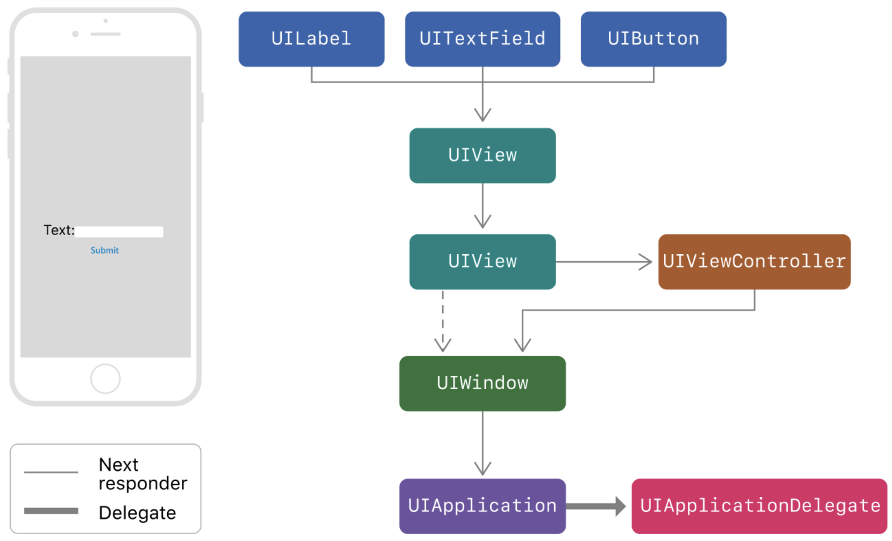
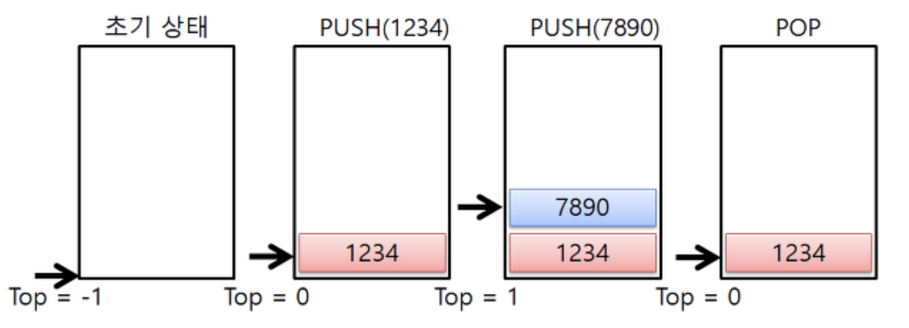
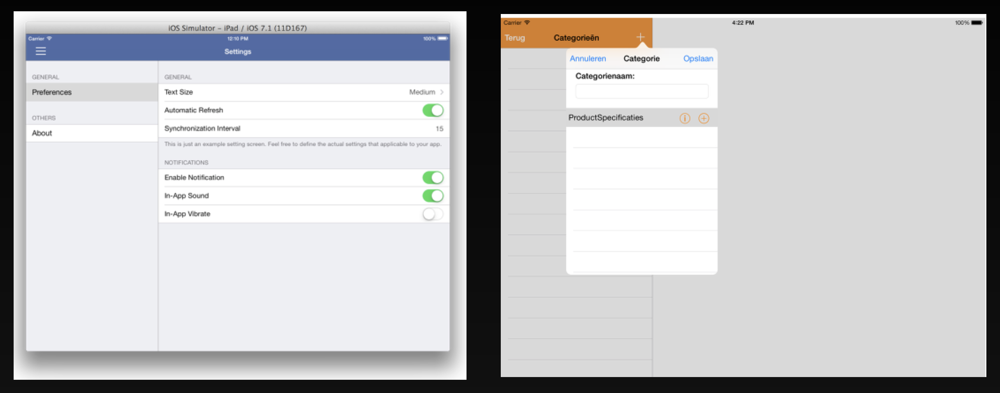
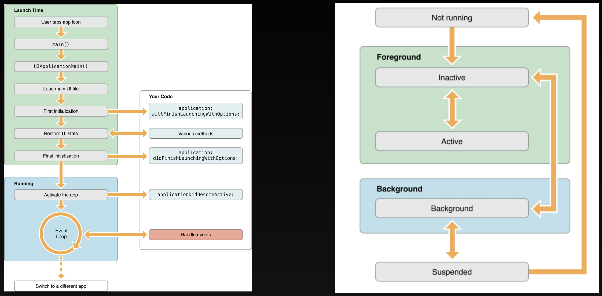
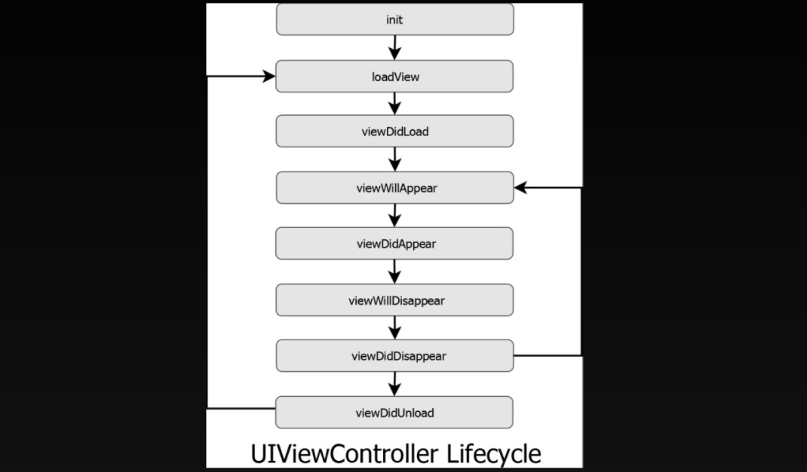
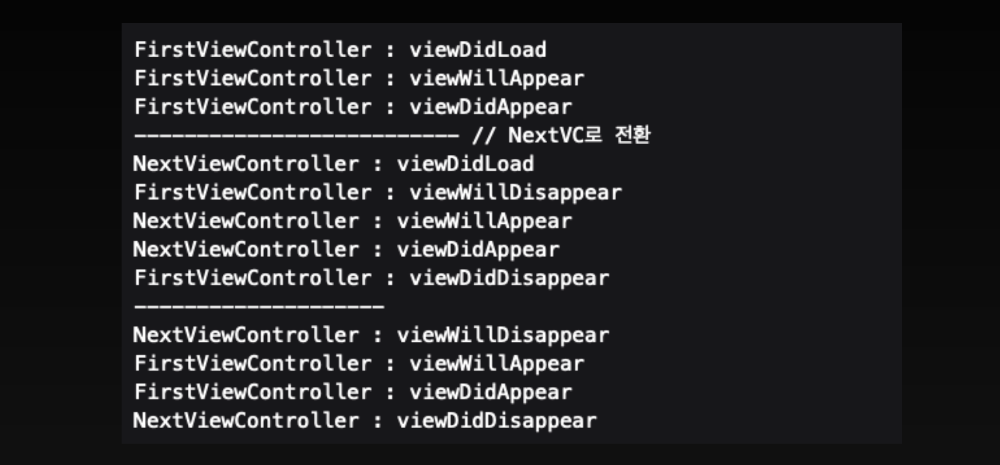

# 5주차 Gesture, Animation NavigationBar, Modal, View & App LifeCycle

21.20.01.06.수

1교시

## Responder Chain

응답자 객체를 이용해 이벤트를 받고 처리

이벤트 데이터를 받고 받드시 이를 직접 처리하거나 다른 응답자 객체에게 전달

ex) keyboard, first responder

### Hit Testing

터치 이벤트가 발생하면 해당 터치가 어느 뷰에서 발생했는지 아는 것이 중요

Hit Testing을 통해 터치가 발생한 뷰를 찾아낼 수 있고 해당 뷰에 이벤트 객체를 전달

### UIResponder

이벤트를 처리하는 객체가 바로 UIResponder를 상속받은 클래스의 객체

ex) UIView, UIViewController, UIWindow 등

### UIEvent

타입별로 이벤트가 발생했을 때 생성되고 응답자 객체에 전달

같은 이벤트에 대한 객체는 재사용된다는 것이 중요

어플리케이션 실행 → 터치 이벤트 발생 → 이벤트 객체 생성 → 객체 재사용

### UITouch

터치 이벤트가 발생하면 이벤트 객체와 동시에 발생한 터치에 관한 정보를 담는 객체

- 터치가 발생한 뷰나 윈도우
- 터치 좌표
- 반지름
- 강도
- 횟수
- 터치된 순간의 시간

### UIControl

`addTarget(_:action:for:)` 메소드로 이벤트와 액션을 연결시켜 처리한다.

UIResponder 메소드보다 상위 수준의 메소드를 제공

→ UIControl이 이벤트를 처리할 때는 이미 이벤트에 대한 분석이 모두 끝난 상태라는 것

## UIGestureRecognizer

ex) 한 손가락 터치, 여러 손가락, 터치, 꼬집기(Pinch), 밀어내기(Swipe), 끌기(Drag), 가장자리 끌기, 꾹 누르기 등

- `state` 라는 프로퍼티가 있고 이를 이용해 액션 메소드를 구현할 수 있다
- 터치가 발생하면 윈도우는 터치 이벤트를 뷰로 전달하기 전에 먼저 Gesture recognizer로 전달한다.

## Animation

Animation 애니메이션이 동작할 때는 원래의 뷰를 복사해서 보여주는 방식이다. 따라시 원래의 뷰는 따로 존재하고 애니메이션 된 뷰를 보여주기 때문에, Gesture Recognizer가 적용되어 있는 뷰에 애니메이션을 주면 제스처가 동작하지 않는다. 원래의 뷰에는 결과값이 미리 반영되어 있는 형태이다.

- `animate(withDuration:animations:)`
- option: .curveLinear 등

애니메이션 효과를 줄 수 있는 속성들

- bounds, frame, center, backgroundColor, alpha, trasform,, etc
- usingSpringWithDamping: 스프링의 강성, 1의 가까울수록 딱딱한 효과
- initialSpringVelocity: 애니메이션의 초기 속도

## NavigationBar

내비게이션 컨트롤러와 함께 화면 상담의 바에 표시되는 내비게이션 컨트롤

### Navigation Controller

하나 이상의 자식 뷰 컨트롤러를 관리하는 컨테이너 뷰 컨트롤러

- 한 번에 하나의 하위 뷰 컨트롤러만 표시된다.
- 스택을 사용하여 자식뷰 컨트롤러를 관리한다.

- 최상위 뷰 컨트롤러가 변경 될 때 내비게이션 바를 업데이트
- tintColor: 막대에 있는 항목의 색조 색상 변경
- barTintColor: 막대 자체의 색조 색상 변경

### NavigationBar

내비게이션 컨트롤러는 내비게이션 바를 자동으로 생성

컨트롤러는 자동으로 자신을 내비게이션바 개체의 delegate로 할당한다. (delegate 할당하면 x)

c.f.) 새창으로 뜨고 레이어에 올려서 뜨는 것을 모달이라고 한다.

- Present Detail, Present As Popover: 아이패드용 화면 전환

## View & App LifeCycle

### App의 Life cycle

→ AppDelegate, SceneDelegate

### ViewController의 LifeCycle

1. `init(coder:)` : storyboard를 통해 ViewController를 만들 경우, 이 시점에 View의 요소들에 대한 접근을 시도한다면 에러 발생

2. `init(nibName:bundle:)`: storyboard가 아닌 분리된 .nib파일로 관리 될 경우

3. `loadView()`: override 하지 않는 것이 좋다. outlet, action

4. `viewDidLoad()`:  이미 outlet들이 모두 메모리에 위치하고 있다., 화면이 보여지기 전 데이터를 뿌려주는 행위에 대한 코드를 작성할 수 있다. 화면이 보여지기 전 백그라운드에서 처리해주어야하는 작업들이 위치 (ex. 네트워크 호출)

   오로지 한번만 호출된다. (에러 발생 시에는 재호출될 수 있음)

5. `viewWillAppear(_:)`: 화면이 올라오고 난 이후에 호출되는 메소드. 화면 전환을 통해 다시 현재의 화면으로 돌아올 때도 호출된다.

6. `viewDidAppear(_:)`: 완전히 뷰가 나타난 이후 호출되는 메소드

7. `viewWillDisapeear(_:)`: 다음 화면으로 전환되기 전, Original View Controller가 화면에서 사라질 때

8. `vieDidDisappear(_:)`: 화면에서 사라지고 나서

9. `deinit()`:  메모리에서 사라지기 전 호출

### View의 cycle

- `awakeFromNib()`
- `init(frame:)`