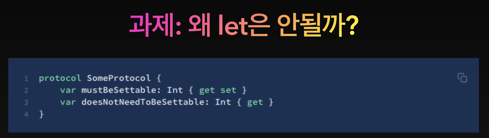

# 6주차 PageViewController, swift(init, Enum, Protocol, Extension, ARC)

## UIPageViewController

콘텐츠 페이지 간 탐색을 관리하는 컨테이너 뷰 컨트롤러로 하위 뷰 컨트롤러가 각 페이지를 관리한다.

UIPageViewControllerDataSource 프로토콜 준수

## Enum

열거형은 관련된 값으로 이루어진 그룹을 공통의 형으로(type) 선언해 형 안전성(typesafety)을 보장하는 방법으로 코드를 다룰 수 있게 해준다.

Swift에서는 case값이 string, character, integer, floting 값들을 사용할 수 있다. 

switch case 문을 사용해서 다음과 같이 활용할 수 있다.

→ `case let .upc` 와 같은 형태로도 사용 가능 (swiftlint)

## Protocol

프로토콜은 특정 기능 수행에 필수적인 요수를 청의한 청사진(blueprint)

프로토콜을 만족시키는 타입을 프로토콜을 따른다(conform)고 말하고, 

프로토콜에 필수 구현을 추가하거나 추가적인 기능을 더하기 위해 프로토콜을 확장(extend)하는 것이 가능하다.

ex) delegate

- 프로토콜을 따르는 타입을 정의하기 위해서는 타입 이름 뒤에 콜론(:)을 붙이고 따를(Conforming) 프로토콜 이름을 적는다.
- 만약 따르는 프로토콜이 여러개라면 콤마(,)로 구분해 준다.
- 서브클래싱인 경우 수퍼클래스를 프로토콜 앞에 적어 준다.

프로토콜에서는 프로퍼티가 저장된 프로퍼티인지 계산된 프로퍼티인지 명시하지 않는다. 

하지만 프로퍼티의 이름과 타입 그리고 gettable, settable한지는 명시한다.

**필수프로퍼티는 항상 var로 선언해야 한다.**

프로토콜에서는 필수 인스턴스 메소드와 타입 메소드를 명시할 수 있다.

하지만 메소드 파라미터의 기본 값은 프로토콜 안에서 사용할 수 없다.

## Extension

익스텐션을 이용해 클래스, 구조체, 열거형 혹은 프로토콜 타입에 기능을 추가할 수 있다. (익스텐션은 Objective-C 의 카테고리와 유사)

retroactive modeling으로 알려진 것과 같이 원본 코드를 몰라도 그 타입에 대한 기능을 확장할 수 있다.

- 계산된 인스턴스 프로퍼티와 계산된 타입 프로퍼티의 추가
- 인스턴스 메소드와 타입 메소드의 추가
- 새로운 이니셜라이저 제공
- 서브스크립트 정의
- 중첩 타입의 선언과 사용
- 특정 프로토콜을 따르는 타입 만들기

익스텐션은 타입에 새 기능을 추가할 수 있지만 오버라이드는(override)는 할 수 없다.

익스텐션은 클래스에 새로운 편리한 이니셜라이저(convenience initializer)를 추가할 수는 있지만,

지정된 이니셜라이저(designated initializers)나 디이니셜라이저(deinitializers)를 추가할 수는 없다. (지정된 이니셜라이저는 항상 반드시 오리지널 클래스의 구현에서 작성 되어야 함)

## Automatic Reference Counting

Swift에서는 앱의 메모리 사용을 관리하기 위해 ARC(Automatic Reference Counting)(자동 참조 카운트)을 사용한다.

자동으로 참조 횟수를 관리하기 때문에 대부분의 경우에 개발자는 메모리 관리에 신경쓸 필요가 없고 ARC가 알아서 더이상 사용하지 않는 인스턴스를 메모리에서 해지한다.

하지만 몇몇의 경우 ARC에서 메모리 관리를 위해 코드의 특정 부분에 대한 관계에 대한 정보를 필요로 한다.

참조 횟수는 `class` 타입의 인스턴스에만 적용되고, 값 타입인 구조체, 열거형 등에는 적용되지 않는다.

클래스의 새 인스턴스를 만들 때마자 ARC는 인스턴스 정보를 담는데 필요한 적정한 크기의 메모리를 할당한다.

이 메모리는 그 인스턴스에 대한 정보와 관련된 저장 프로퍼티 값도 가지고 있다.

추가적으로 인스턴스가 더이상 사용되지 않을 때 ARC는 그 인스턴스가 차지하고 있는 메모리를 해지해서 다른 용도로 사용할 수 있도록 공간을 확보해 둔다.

하지만 만약 ARC가 아직 사용중인 인스턴스를 메모리에서 내렸는데 인스턴스의 프로퍼티에 접근한다면 앱은 아마 크래시가 발생하게 된다.

ARC에서는 아직 사용중인 인스턴스를 해지하지 않기 위해 얼마나 많은 프로퍼티, 상수 혹은 변수가 그 인스턴스에 대한 참조를 갖고 있는지 추적한다. 

그래서 ARC는 최소 하나라도 그 인스턴스에 대한 참조가 있는 경우 그 인스턴스를 메모리에서 해지 하지 않는다.

강한 참조 순환 문제를 해결하기 위해서는 두가지 방법이 있다.

1. weak 참조 사용
2. unowned 참조 사용

두 가지 모두 ARC에서 참조 횟수를 증가시키지 않고 인스턴스를 참조하기 때문에 강한 참조 순환 문제를 해결할 수 있다. 

→ `deinit` 이 잘 호출되고 있는지 `print()` 를 통해 디버깅하는 방법이 있음

약한 참조는 참조하고 있는 인스턴스가 먼저 메모리에서 해제될때 사용하고 미소유 참조는 반대로 참조하고 있는 인스턴스가 같은 시점 혹은 더뒤에 해제될때 사용한다. 

위 Apartment 예제에서 Apartment의 tenant는 없는 상태가 될 수 있기 때문에 (먼저 해지되기 때문에) 약한 참조를 사용하는 것이 적절하다.

클로저가 나중에 동작할 때 까지 참조가 일어나야 하는 경우에는 `self` 를 `weak` 로 사용하는 것이 아니라 그 반대로 사용하는 방식으로 해결할 수 있다.

swift 문서를 살펴보는 것을 추천

## Initialization

인스턴스를 사용하기 위해 준비 작업을 하는 단계로, 이 단계에서 각 저장 프로퍼티의 초기 값을 설정한다.

`initializer` 를 정의하는 것으로 구현할 수 있다. (Swift의 initializer는 값을 반환하지 않음) 

초기화와 반대로 여러 값과 자원의 해지를 위해 deinitializer도 사용할 수 있다.

- **인스턴스의 저장 프로퍼티는 사용하기 전에 반드시 특정 값으로 초기화 되어 있어야 한다.**

    이 값으로 기본 값을 설정할 수 있고, 특정 값을 설정할 수도 있다.

    initializer에서 저장 프로퍼티에 값을 직접 설정하면 프로퍼티 옵저버가 호출되지 않고 값 할당이 수행된다.

- ex

- 프로퍼티의 최초 값이 없고 나중에 추가될 수 있는 값을 옵셔널로 선언해 사용할 수 있다. 옵셔널 프로퍼티는 자동으로 nil로 초기화
- 프로퍼티를 let으로 선언해서 이 프로퍼티는 처음에 초기화 되면 변경되지 않는 프로퍼티라는 것을 표현할 수 있다.

    만약 모든 프로퍼티의 초기값이 설정돼 있고, 하나의 초기자도 정의하지 않았다면, 

    Swift는 모든 프로퍼티를 기본 값으로 초기화 하는 기본 초기자를 제공해 준다.

### 구조체 이니셜라이저

기본 이니셜라이저와 다르게 맴버쪽 이니셜라이저는 프로퍼티가 기본 값이 없어도 

커스텀 이니셜라이저를 정의하지 않았다면 멤버쪽 이니셜라이저를 제공해 준다. 이 초기자는 선언한 모든 프로퍼티를 인자로 사용

- 지정 초기자는 클래스의 주(primary) 초기자. 지정 초기자는 클래스의 모든 프로퍼티를 초기화 한다.

    클래스 타입은 반드시 한개 이상의 지정 초기자가 있어야 한다.

- 편리한 초기자는 초기화 단계에서 미리 지정된 값을 사용해서 최소한의 입력으로 초기화를 할 수 있도록 해주는 초기자

    편리한 초기자는 반드시 지정 초기자를 호출하는 초기자이다.

### 규칙

1. 지정 초기자는 반드시 직계 superclass의 지정 초기자를 호출해야 한다.
2. 편리한 초기자는 반드시 같은 클래스의 다른 초기자를 호출해야 한다.
3. 편리한 초기자는 궁극적으로 지정초기자를 호출해야 한다.

### Swift에서 클래스 초기화

1. 각 저장된 프로퍼티는 초기값으로 초기화 된다. 

    모든 저장된 프로퍼티의 상태가 결정되면 두번째 단계가 시작된다.

2. 새로운 인스턴스의 사용이 준비됐다고 알려주기 전에 저장된 프로퍼티를 커스터마이징

### 안전 확인 단계

1. 지정 초기자는 클래스 안에서 초기화를 **superclass의 초기자에게 위임하기 전에 모든 프로퍼티를 초기화** 해야 한다.

    메모리에서 객체는 모든 저장된 프로퍼티가 초기 상태를 갖어야만 완전히 초기화 된것으로 간주되기 때문에,

    이 규칙을 만족시키기 위해 지정 초기자는 반드시 다른 초기자로 넘기기 전에 소유하고있는 모든 프로퍼티를 초기화 해야 한다.

2. 지정 초기자는 반드시 `상속된 값을 할당하기 전`에 **superclass의 초기자로 위임을 넘겨야 한다.**

    그렇지 않으면 상속된 값이 superclass이 초기자에 의해 덮어 쓰여지게 된다.

3. 편리한 초기자는 반드시 어떤 **프로퍼티를 할당하기 전에 다른 초기자로 위임을 넘겨야 한다.** 

    그렇지 않으면 편리한 초기자에 의해 할당된 값을 다른 클래스의 지정 초기자에 의해 덮어 쓰여지게 된다.

4. 이니셜라이저는 초기화의 1단계가 끝나기 전에는 self의 값을 참조하거나 어떤 인스턴스 프로퍼티, 메소드 등을 호출하거나 읽을 수 없다.

서브클래스는 수퍼클래스의 초기자를 기본적으로 상속하지 않지만, 

특정 상황에서 자동으로 상속을 받는다. (사실 많은 상황에서 직접 초기자를 오버라이드 할 필요가 없다)

서브클래스에서 새로 추가한 모든 프로퍼티에 기본 값을 제공하면 다음 두가지 규칙이 적용된다.

1. 서브클래스가 지정초기자를 정의하지 않으면 자동으로 수퍼클래스의 모든 지정초기자를 상속한다.

    

2. 서브클래스가 수퍼클래스의 지정초기자를 모두 구현한 경우(규칙 1의 경우 혹은 모든 지정초기자를 구현한 경우) 자동으로 수퍼클래스의 편리한 초기자를 추가한다.

    

- 초기화 과정 중에 실패할 가능성이 있는 초기자를 init뒤에 물음표(?)를 사용해 실패가 가능
한 초기자라고 표시할 수 있습니다.

- 모든 서브클래스에서 반드시 구현해야 하는 초기자에는 아래 예제와 같이 required 키워드를 붙여 준다.

- 기본 값 설정이 단순히 값을 할당하는 것이 아니라 다소 복잡한 계산을 필요하다면 클로저나 함수를 이용해 값을 초기화 하는데 이용할 수 있다.

    기본값을 지정하기 위해 클로저를 사용하는 형태의 코드는 보통 다음과 같다.

→ 클로저를 초기자에서 사용하면 클로저 안에 self나 다른 프로퍼티를 사용할 수 없다. 클로저가 실행될 시점에 다른 프로퍼티는 초기화가 다 끝난 것이 아니기 때문

### lazy

지연 저장 프로퍼티는 값이 처음으로 사용 되기 전에는 계산되지 않는 프로퍼티

지연 저장 프로퍼티로 선언하기 위해서는 프로퍼티의 선언 앞에 `lazy` 키워드를 붙이면 된다.

상수는 초기화가 되기전에 항상 값을 같는 프로퍼티인데, 

지연 프로퍼티는 처음 사용되기 전에는 값을 갖지 않는 프로 퍼티이기 때문에, 반드시 변수(var)로 선언해야 한다.

- 프로퍼티가 특정 요소에 의존적이어서 그 요소가 끝나기 전에 적절한 값을 알지 못하는 경우에 유용
- 복잡한 계산이나 부하가 많이 걸리는 작업을 지연 프로퍼티로 선언해 사용하면 실제 사용되기 전에는 실행되지 않아서 인스턴스의 초기화 시점에 복잡한 계산을 피할 수 있다.