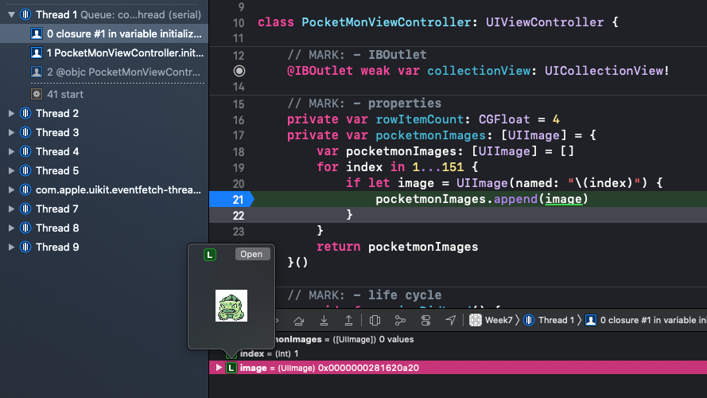

# 7주차 ScrollView, CollectionView, Certification, 배포, Debug

- 지난주 과제
    1. 왜 프로토콜 변수 선언땐 let이 안될까?

        이 질문에 정확한 답은 없음.

        초기에는 메소드만 있었는데 이후에 인터페이스가 발전하면서 변수가 추가되었다. 왜 상수는 추가되지 않았는가? → 불변의 값들은 항상 함수로 처리했었음

    2. weak와 unowned의 차이

        unowned도 optional 값을 할당할 수 있도록 변경됨. (Swift 5.0) 

        → 하지만 해당 값을 사용할 때 optional chaining을 하지 않아도 된다는 차이점이 있음.

        weak는 레퍼런스 카운트가 0일 때 해당 변수에 자동으로 nil을 할당해 주지만, unowned로 선언된 변수는 해제된 쓰레기 값 포인터를 그대로 가지고 있어서 그 값에 접근하면 크래쉬가 발생할 수 있다.


## UIScrollView


## UICollectionView


```swift
class PocketMonViewController: UIViewController {
    
    // MARK: - IBOutlet
    @IBOutlet weak var collectionView: UICollectionView!
    
    // MARK: - properties
    private var rowItemCount: CGFloat = 4
    private var pocketmonImages: [UIImage] = {
        var pocketmonImages: [UIImage] = []
        for index in 1...151 {
            if let image = UIImage(named: "\(index)") {
                pocketmonImages.append(image)
            }
        }
        return pocketmonImages
    }()

    // MARK: - life cycle
    override func viewDidLoad() {
        super.viewDidLoad()
        
        let flowLayout = UICollectionViewFlowLayout()
        flowLayout.minimumInteritemSpacing = 10
        flowLayout.minimumLineSpacing = 10
        flowLayout.sectionInset = UIEdgeInsets(top: 20, left: 0, bottom: 20, right: 0)
        
        let itemWidth = (UIScreen.main.bounds.width - (10 * (rowItemCount - 1))) / rowItemCount
        flowLayout.itemSize = CGSize(width: itemWidth, height: itemWidth)
        collectionView.collectionViewLayout = flowLayout
    }
}

// MARK: - UICollectionViewDelegate
extension PocketMonViewController: UICollectionViewDelegate {
    
}

// MARK: - UICollectionViewDataSource
extension PocketMonViewController: UICollectionViewDataSource {
    func collectionView(_ collectionView: UICollectionView, numberOfItemsInSection section: Int) -> Int {
        return pocketmonImages.count
    }
    
    func collectionView(_ collectionView: UICollectionView, cellForItemAt indexPath: IndexPath) -> UICollectionViewCell {
        guard let cell = collectionView.dequeueReusableCell(withReuseIdentifier: "PocketmonCollectionViewCell", for: indexPath) as? PocketmonCollectionViewCell else { return .init() }
        cell.pocketmonImageView.image = pocketmonImages[indexPath.item]
        return cell
    }
}
```

## Celtification

[https://developer.apple.com/](https://developer.apple.com/)


## 배포

[https://appstoreconnect.apple.com/](https://appstoreconnect.apple.com/)

## 디버깅

`break point`

### Debug Area


### lldb

Xcode에 기본으로 내장 되어 있는 debugger

[https://lldb.llvm.org/](https://lldb.llvm.org/)

- `print` `p`
- `expr` `e` : 값을 변경할 때
- `po` : 객체화 하여 출력할 때

### 직접 사용해보기

`spacebar` 를 눌러 미리보기



`step into`: 함수 내부로 들어가기


`po` 로 출력해보기 - 객체화 되어 출력된다.


`#DEBUG` : debug, release 타임일 때 분리 가능

```swift
#if DEBUG
    println("Debug Mode")
#else
    println("Release Mode")
#endif
```
